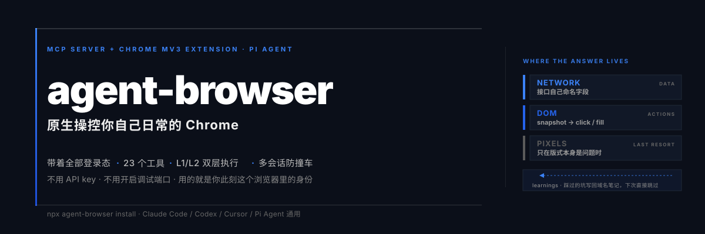
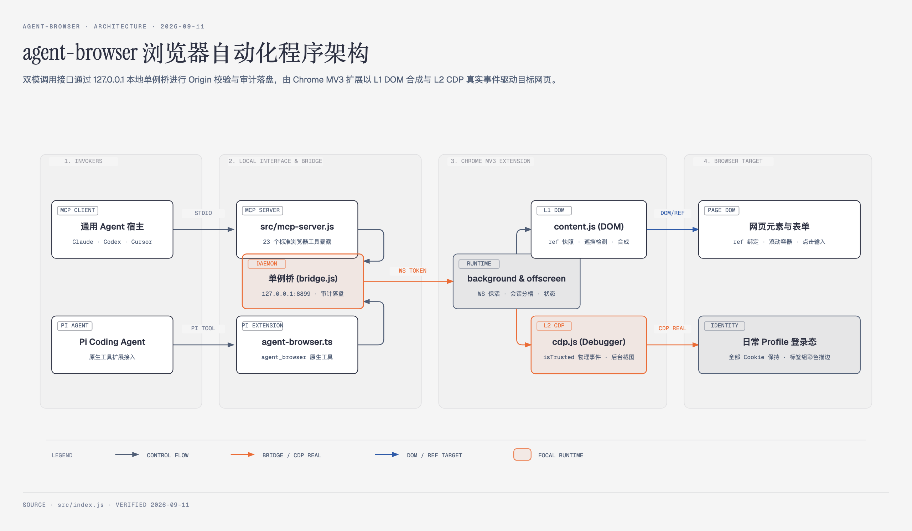
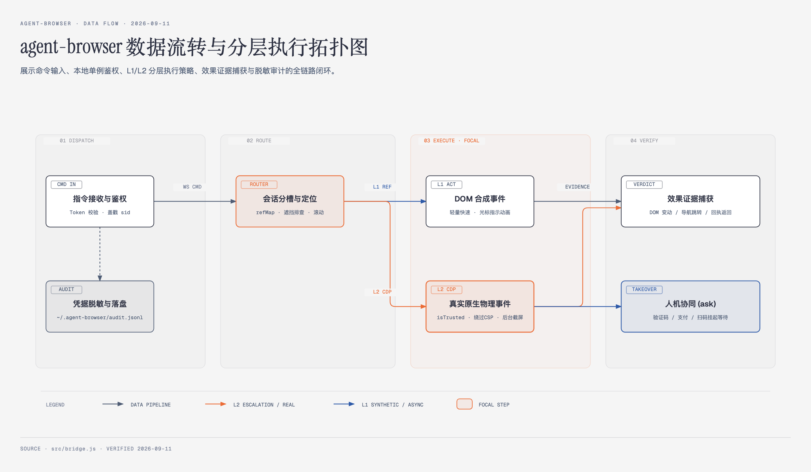

<div align="center">



# chrome-agent-browser

**本地 AI Agent 原生浏览器自动化工具包**

保持日常 Chrome 的完整登录态与 Cookie，支持 Claude Code / Cursor / Codex / Pi Agent 等通用 MCP 调度，
并提供 Pi Agent 原生工具扩展支持。

[](LICENSE)
[](#五快速安装与环境准备)
[](#七23-个核心工具详解)
[](#十一常见排错与诊断)

</div>

---

## 目录

- [一、核心定位与特性](#一核心定位与特性)
- [二、系统程序架构图](#二系统程序架构图)
- [三、全链路数据流转图](#三全链路数据流转图)
- [四、引导页面怎么看](#四引导页面怎么看)
- [五、快速安装与环境准备](#五快速安装与环境准备)
- [六、Agent 接入与使用指南](#六agent-接入与使用指南)
  - [模式 A：作为 MCP 服务供通用 Agent 调用](#模式-a作为-mcp-服务供通用-agent-调用)
  - [模式 B：Pi Coding Agent 原生扩展调用](#模式-bpi-coding-agent-原生扩展调用)
- [七、23 个核心工具详解](#七23-个核心工具详解)
- [八、L1 / L2 自适应执行机制](#八l1--l2-自适应执行机制)
- [九、多 Agent 会话隔离与视觉幕帘](#九多-agent-会话隔离与视觉幕帘)
- [十、常用 CLI 命令速查](#十常用-cli-命令速查)
- [十一、常见排错与诊断](#十一常见排错与诊断)
- [十二、开源合规声明](#十二开源合规声明)

---

## 一、核心定位与特性

1. **日常真实环境与登录态**：直接操控你日常使用的 Chrome，无需创建空白的自动化 profile，无需重新扫码登录，免受验证码困扰。
2. **免改启动参数与远程端口**：无需开启 `--remote-debugging-port`，免改浏览器快捷方式，装上解压扩展即可建立连接。
3. **双重接入形态**：
   - **MCP 模式**：通过标准 stdio JSON-RPC 暴露给 Claude Code、Cursor、Codex CLI、Gemini CLI 等；
   - **Pi 原生模式**：通过一键安装生成 `agent_browser` 原生工具扩展，零适配直连。
4. **L1 / L2 双层自适应穿透执行**：
   - 默认使用轻量 DOM 级合成事件（L1），速度极快；
   - 遇到 `isTrusted` 物理事件校验、Monaco/CodeMirror 富文本、文件上传或后台截图时，无缝升级调用 `chrome.debugger` 原生 CDP（L2）。
5. **多会话槽（Slot）隔离防撞车**：多个 Agent 并发操作时自动分配独立彩色标签槽与标签组，防止相互踩踏。
6. **视觉幕帘**：Agent 截图时会自动拉下视觉幕帘隐藏高亮边框和调试面板，避免模型产生“幻觉”。
7. **全本地安全链路**：单例桥仅监听 `127.0.0.1`，严格校验 `chrome-extension://` Origin 头，绝不让恶意外部网页向控制链路渗透。
8. **全页面长截图与浮层防重叠**：支持 `fullPage: true` 完整截取长网页，自动去重 `fixed`/`sticky` 导航条与底部浮动栏，带尺寸约束防 OOM 内存爆炸。
9. **显式标签页借用与归还生命周期**：支持 `tabs(action: "borrow" | "return")`，操作用户已有标签前弹出授权浮层，任务完成后干净归还并解除控制。
10. **复杂交互增强（Hover 预探测 + Canvas 图像坐标点击）**：快照自动打标折叠菜单与 Canvas，支持主动探测二级下拉项；截图返回 `captureId`，支持按图像像素坐标发起物理点击。
11. **规范化页内 Human-in-the-Loop 浮层**：触发验证码、扫码登录或支付时，在页面中央置顶弹出毛玻璃提示条，且不阻挡底层页面交互，用户完成后点击秒级恢复。
---

## 二、系统程序架构图



> 高清原图：[`docs/diagrams/agent-browser-architecture.png`](docs/diagrams/agent-browser-architecture.png) · 可交互 HTML 版：[`docs/diagrams/agent-browser-architecture.html`](docs/diagrams/agent-browser-architecture.html)

四条信任/部署边界（Zone）：

| Zone | 组成 | 职责 |
|---|---|---|
| **① INVOKERS** | 通用 Agent 宿主（Claude / Codex / Cursor / Pi 等） | 发起指令，不接触凭据 |
| **② LOCAL INTERFACE & BRIDGE** | `src/mcp-server.js`（stdio MCP）、Pi 扩展适配层、单例桥 `src/bridge.js` | 协议适配、Token 鉴权、会话分槽路由、审计落盘 |
| **③ CHROME MV3 EXTENSION** | `background.js` + `offscreen.js`、`content.js`（L1 DOM）、`cdp.js`（L2 CDP） | 命令分发、保活、DOM 合成事件与原生 CDP 物理事件 |
| **④ BROWSER TARGET** | 网页元素与表单、日常 Profile 登录态 | 真实身份、真实 Cookie、真实渲染 |

图中高亮（Focal）节点为「单例桥」与「L2 CDP 引擎」——前者是全机唯一的路由与鉴权枢纽，后者是穿透强反爬站点的最终手段。

---

## 三、全链路数据流转图



> 高清原图：[`docs/diagrams/agent-browser-data-flow.png`](docs/diagrams/agent-browser-data-flow.png) · 可交互 HTML 版：[`docs/diagrams/agent-browser-data-flow.html`](docs/diagrams/agent-browser-data-flow.html)

四个阶段（Stage）与两条执行分支：

| 阶段 | 关键动作 | 产出 |
|---|---|---|
| **01 DISPATCH** | Token 校验、盖戳 `sid`；同时**并行**把脱敏后的记录写入 `~/.chrome-agent-browser/audit.jsonl` | 已鉴权且带会话身份的命令 |
| **02 ROUTE** | 会话分槽与目标定位：`refMap` 解析、视口滚动、物理遮挡排查 | 视口坐标 + 可执行基线 |
| **03 EXECUTE**（Focal） | **L1**：DOM 合成事件（轻量快速）；**L2**：`chrome.debugger` 原生 CDP 真实物理事件（`isTrusted`、绕过 CSP、后台截屏） | 动作已落地 + 效果证据 |
| **04 VERIFY** | 效果证据捕获（DOM 变动 / 导航跳转 / 回执返回）；若遇验证码、扫码或支付 → `ask` 人机协同挂起 | 成功回执，或交还人工 |

> 图例：**实线**为命令与数据管道；**虚线**为审计旁路（被动、并行落盘）；**橙色**为 L2 CDP 升级与真实事件路径；**蓝色**为 L1 合成事件与异步协作路径。

---

## 四、引导页面怎么看

项目中内置了精美的可视化离线图解安装说明书（`src/guide.html`），有以下 **4 种查看方式**：

### 方式 1：CLI 便捷命令（最推荐）
在项目目录下直接运行：
```bash
node src/cli.js guide
```
系统会自动调用默认浏览器秒级打开说明书页面。

### 方式 2：系统终端直接打开
- **macOS**：
  ```bash
  open src/guide.html
  ```
- **Windows**：
  ```cmd
  start src/guide.html
  ```
- **Linux**：
  ```bash
  xdg-open src/guide.html
  ```

### 方式 3：自动安装流程触发
当你执行一键配置命令时：
```bash
node src/cli.js install
```
脚本在配置好各 Agent 的 MCP 设置后，会自动在浏览器中弹开该引导页。

### 方式 4：浏览器直接访问本地文件
在 Chrome 地址栏直接输入并回车：
```
file:///Users/zero/Desktop/agent-browser/src/guide.html
```

---

## 五、快速安装与环境准备

### 1. 基础环境
- Node.js ≥ 20.0.0
- Google Chrome 浏览器

### 2. 加载 Chrome 扩展（只需一次）
1. 打开 Chrome 浏览器，地址栏输入 `chrome://extensions`；
2. 开启右上角的**「开发者模式」**开关；
3. 点击左上角的**「加载已解压的扩展程序」**；
4. 选择当前项目的扩展目录：
   ```
   /Users/zero/Desktop/agent-browser/extension
   ```
5. 点击 Chrome 工具栏右上角拼图图标，将 `chrome-agent-browser` 固定在工具栏。

### 3. 一键配置本机 Agent
在项目根目录下运行：
```bash
node src/cli.js install
```
它会自动扫描本机已安装的 Agent（Claude Code / Codex / Cursor / Windsurf / Cline 等），并安全写入 MCP 配置（操作前会自动备份原配置文件）。

### 4. 连通性体检
运行体检命令：
```bash
node src/cli.js doctor
```
看到「配置目录正常」、「桥握手正常」、「Chrome 扩展在线」即表示全链路就绪！

---

## 六、双模使用指南

### 模式 A：作为 MCP 服务供通用 Agent 调用

安装完成后，在你的 Agent 客户端（如 Claude Code / Cursor）中直接用自然语言交流即可：
```
「帮我在 Chrome 里打开京东，搜索降噪耳机并把前 5 款的价格和评价拉下来」
「在当前打开的 CRM 后台里，帮我新建一个客户记录」
「把这篇排版好的文档发布到知乎草稿箱」
```

若手动给第三方客户端配置，在对应配置文件中的 `mcpServers` 节点添加：
```json
{
  "mcpServers": {
    "chrome-agent-browser": {
      "command": "npx",
      "args": ["-y", "chrome-agent-browser", "mcp"]
    }
  }
}
```
（本地源码调试可使用 `"command": "node", "args": ["<项目绝对路径>/src/cli.js", "mcp"]`）

---

### 模式 B：Pi Coding Agent 原生扩展调用

运行 `chrome-agent-browser install`（或 `node src/cli.js install`）后，安装器会自动在 `~/.pi/agent/extensions/chrome-agent-browser.ts` 生成原生工具定义。在 Pi 会话中即可直接使用：

```typescript
// Pi Agent 对话中可直接调用 agent_browser 工具：
// action: 动作名，如 snapshot, click, type, tabs, wait, read_text, screenshot 等
// params: 动作入参对象，如 { tabId, ref, text }
```

例如在对话中输入：
> “使用 agent_browser 打开 B 站并搜索小白测评”

Pi Agent 会调用 `agent_browser(action="tabs", params={action:"new", url:"https://www.bilibili.com"})`，并通过本地 Bridge 驱动正在运行的 Chrome。

---

## 七、23 个核心工具详解

| 工具名称 | 关键入参 | 功能描述 |
|---|---|---|
| `snapshot` | `tabId` | 捕获当前页面的可交互元素结构化快照，提取 ARIA 状态，分配稳定标号（`e1`, `e2`...） |
| `click` | `ref`, `selector`, `find`, `expect`, `real`, `x`, `y`, `dragTo` | 点击元素。默认 L1 合成派发，无效果或特殊控件自动升级 L2 原生物理点击，支持坐标与拖拽 |
| `type` | `ref`, `text`, `clear`, `submit`, `find`, `selector`, `expect`, `real` | 文本录入，支持输入后按 Enter 提交、清空已有内容，兼容 Monaco/CodeMirror 富文本 |
| `select` | `ref`, `value`, `find`, `expect` | 原生 `<select>` 选项匹配（按 label 或 value），保持在 DOM 级派发规避原生弹窗阻塞 |
| `fill` | `fields: [{ ref, text, value, check, clear }]`, `submit`, `submitRef`, `snapshotId` | 批量整表填充并可选触发提交，任意字段失败时中止提交 |
| `key` | `key`（单键/组合键/序列数组）, `ref`, `repeat`, `real` | 派发键盘事件（如 `Escape`, `Enter`, `Tab`, `ArrowDown`），自动补齐浏览器原生默认行为 |
| `read_text` | `tabId`, `format: "markdown" \| "text"` | 提取主正文内容，已过滤脚本/样式噪声与 4 类 CSS 隐藏文本，自动屏蔽成组高熵恢复码 |
| `navigate` | `url`, `action: "back" \| "forward" \| "reload"`, `tabId` | 页面跳转与历史导航，严格等待导航提交与 DOM 就绪并返回新页面快照 |
| `tabs` | `action: "list" \| "new" \| "select" \| "close"`, `url`, `label`, `focus`, `tabId` | 标签页管理。默认后台静默开页，支持会话独立彩虹槽与标签组归属 |
| `screenshot` | `tabId`, `savePath`, `full: boolean`, `focus` | 页面截屏。通过 CDP 支持直接截取后台非激活标签页；拍摄瞬间自动拉下视觉幕帘 |
| `wait` | `for: "selector" \| "text" \| "idle"`, `value`, `timeout`, `tabId` | 条件等待：等待选择器出现、文本呈现或网络空闲 |
| `scroll` | `to: "bottom" \| "top"`, `times`, `wait`, `ref`, `tabId` | 页面或指定内部容器懒加载平滑滚动，高度停止增长时自愈早停 |
| `network` | `match`, `body`, `index`, `reload`, `maxBody`, `tabId` | 检查页面 XHR / Fetch 请求目录，或按 URL 片段提取指定响应体 |
| `fetch` | `url`, `init`, `pages`, `binary`, `via: "page" \| "extension"`, `savePath`, `maxBody` | 在页面上下文发请求（带 Cookie）；`pages` 自动按页码/游标遍历落盘；二进制走扩展直连 |
| `download` | `url`, `savePath`, `timeout` | 驱动浏览器原生静默下载大文件并自动转移至指定本地路径，不弹系统保存对话框 |
| `upload` | `path`, `selector`, `dropSelector`, `tabId` | 本地文件上传：优先走 CDP 直接注入本地路径（零内存拷贝）；不支持时降级至拖拽 Base64 |
| `query` | `selector`, `contains`, `extract`, `html`, `limit`, `tabId` | 结构化数据提取或按可见文本查找元素选择器路径 |
| `act` | `steps: [...]`, `allowSensitive`, `snapshotId`, `tabId` | 批处理剧本执行器：支持单次往返执行多步、循环（`repeat`）、条件判断（`if`）与断言（`assert`） |
| `ask` | `prompt`, `title`, `targets`, `until`, `timeout`, `focus` | 人工介入通道：遇验证码、人脸或扫码时唤起顶层浮条与桌面通知，支持自动完成条件探活 |
| `status` | `text`（≤80字） | 向页面右下角驾驶舱广播即时意图声明，零开销单向同步 |
| `eval` | `expr`, `maxLength`, `tabId` | 页面 MAIN world 执行 JS；求值期间强制安装支付点击拦截闸门，遇严格 CSP 升级 CDP 执行 |
| `learnings` | `domain`, `save` | 纯本地读取或保存针对站点的操作经验与避坑剧本 |
| `reload` | - | 扩展在线热重载，无需重启 Chrome 即可重新连接 Bridge |

---

## 八、L1 / L2 自适应执行机制

为同时兼顾**“轻量极速”**与**“穿透一切复杂反爬”**，系统内置了 L1/L2 双层自适应引擎：

```
                    发起操作 (如 click)
                            │
                            ▼
               [ L1 快速合成事件引擎派发 ]
                            │
              ┌─────────────┴─────────────┐
              ▼                           ▼
       [ 检测到效果证据 ]           [ 零证据 / 静默失效 ]
       - DOM 节点发生改变           - 遇 isTrusted 物理事件校验
       - 页面发生跳转导航           - Monaco / 富文本编辑器内部状态未变
              │                           │
              ▼                           ▼
        立刻成功返回             [ 动态升级 L2 原生 CDP 调试器 ]
                             (Input.dispatchMouseEvent / dispatchKeyEvent)
                                          │
                                          ▼
                                   真实物理级动作落地
```

- **L1 模式**：基于 DOM 合成事件派发，零调试条干扰，速度快至几毫秒；
- **L2 模式**：基于 `chrome.debugger`，产生操作系统级真实物理事件，通过 `isTrusted: true` 校验。

---

## 九、多 Agent 会话隔离与视觉幕帘

- **独立彩虹槽位**：每个 Agent 进程根据其 `sessionId` 哈希分配专属于它的颜色（14 色轮换）与 Chrome 标签组，受控页面会自动加上彩色边框与右下角状态胶囊；
- **截图幕帘（Stealth Mode）**：当 Agent 发起 `screenshot` 截屏请求时，扩展会在捕获瞬间将所有自身绘制的边框、高亮框与驾驶舱完全隐藏，截取最真实的原始网页，截取完毕立即恢复，彻底杜绝模型把自身标记当成网页内容产生幻觉。

---

## 十、常用 CLI 命令与构建流水速查

```bash
# 打开图形化安装说明书
node src/cli.js guide

# 诊断本机连通性状态
node src/cli.js doctor

# 自动配置本机各 Agent
node src/cli.js install

# 仅查看配置计划（不实际写入）
node src/cli.js install --dry-run

# 显示扩展解压加载目录路径
node src/cli.js extension

# 在访达/资源管理器中直接选中并定位扩展目录
node src/cli.js extension --reveal

# 查看最近的本地浏览器操作审计记录
node src/cli.js audit -n 30

# 查看真实 Agent 的操作统计与回合数分析
node src/cli.js audit --stats --days 7

# 启动本地单例桥（调试底层日志使用）
node src/cli.js bridge

# 运行全量单元与协议测试（122 项）
npm test

# 运行真实 Chrome 自动化端到端套件（93 项）
npm run test:live

# 全量构建与分发打包（版本一致性核验、生成 Web Store 剥离 key 的 zip、校验 npm 分发清单）
npm run build
# 或
npm run pack
```

---

## 十一、常见排错与诊断

1. **运行 `doctor` 提示“Chrome 扩展这会儿没连着桥”**：
   - 检查 Chrome 是否已启动；
   - 检查 `chrome://extensions` 中 `chrome-agent-browser` 扩展是否开启；
   - 点击浏览器工具栏的 `chrome-agent-browser` 图标，点击弹窗中的「重连」按钮。
2. **需要 L2 真实物理模式时提示权限未开**：
   - 点击工具栏 `chrome-agent-browser` 扩展图标，在弹窗中将「高保真模式」开启即可。
3. **自研服务提示端口冲突**：
   - 本地桥默认监听 `8899` 端口，扩展会在 `8899–8903` 范围进行并发探测。若 `8899` 被其它服务占用，桥可指定范围内可用端口（如 8900），扩展将自动连接。
4. **自定义测试目录**：
   - 支持通过 `export CHROME_AGENT_BROWSER_HOME=/tmp/cab_home` 将配置与审计日志隔离至临时目录。

---

## 十二、开源合规声明

本项目采用 MIT License 开源，详见 [LICENSE](LICENSE)。
